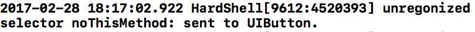

# HardShell

HardShell is a protector to keep app from specific crashes. Now it only protects app from the crash caused by "unrecognized selector sent to instance". More features will come step by step.

The idea is from [Baymax's introduction](https://neyoufan.github.io/2017/01/13/ios/BayMax_HTSafetyGuard/) which is from Wangyi (Hangzhou). They promise Baymax SDK will be released but don't mention the schedule and if it will be opensourced. So I build HardShell.

It is still at early stages and not product ready to launch. Please help me to do more testing.  

### unrecognized selector crash

The following code will crash you app because of “unrecognized selector crash” which is very popular in iOS apps.

```
    UIButton *button = [[UIButton alloc] init];
    [button performSelector:@selector(noThisMethod:)];
```

HardShell will protect it from this crash. Let’s show before and after.

Before:


After:

The crash disappeared and the root cause is shown.



Other features will come soon.

### License

This code is distributed under the terms and conditions of the MIT license.

### Thanks

Great idea from Baymax of Wangyi (Hangzhou).
